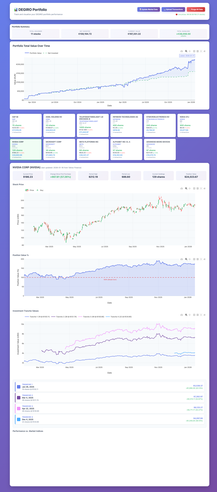

# DEGIRO Portfolio Tracker

A desktop application that helps you track and visualize your DEGIRO investment portfolio with beautiful charts and performance metrics.

## What Does This Do?

This application takes your DEGIRO transaction exports (the Excel files you download from DEGIRO) and creates an interactive dashboard where you can:

- **See all your stocks in one place** - View your current holdings with live prices
- **Track your gains and losses** - See how much money you've made or lost on each stock
- **View beautiful charts** - Interactive price charts showing your buy/sell transactions
- **Compare against market indices** - See how your stocks perform vs S&P 500 and Euro Stoxx 50
- **Monitor multiple currencies** - Automatic conversion to EUR for stocks in USD, SEK, GBP
- **Upload new transactions easily** - Just drag and drop your Excel file into the web interface

All data is stored securely on your own computer - nothing is sent to external servers.

## Screenshots

### Portfolio Dashboard

*Your portfolio at a glance with live prices and performance charts*

### Individual Stock View

*Detailed charts showing NVIDIA price history, buy transactions, position value %, and market comparison*

## Installation

### Prerequisites

Before you begin, you need:
1. **Python 3.11 or newer** - [Download Python here](https://www.python.org/downloads/)
2. **uv package manager** - Install it by opening Terminal/Command Prompt and running:
   ```bash
   pip install uv
   ```

### Step 1: Download the Application

Download or clone this repository to your computer.

### Step 2: Install

Open Terminal (Mac/Linux) or Command Prompt (Windows), navigate to the folder where you downloaded the application, and run:

```bash
uv sync
```

This will download and install all the necessary components. It may take a few minutes the first time.

### Step 3: Prepare Your Data (First Time Only)

If you want to try the application with sample data first:

```bash
uv run invoke setup
```

This will import example stock transactions and download their price history.

**Or**, to import your own DEGIRO data:

1. Log into your DEGIRO account
2. Go to Activity → Transactions
3. Export your transactions as an Excel file
4. Name it `Transactions.xlsx` and place it in the same folder as this application
5. Run: `uv run invoke import-data`

### Step 4: Start the Application

Run this command:

```bash
./degiro-portfolio start
```

**On Windows**, use:
```bash
python degiro-portfolio start
```

The application will start, and you should see a message like "Server started on port 8000".

### Step 5: Open the Dashboard

Open your web browser and go to:
```
http://localhost:8000
```

You should now see your portfolio dashboard!

## Using the Application

### Managing the Server

The application runs a small web server on your computer. You can control it with these commands:

```bash
./degiro-portfolio start    # Start the server
./degiro-portfolio stop     # Stop the server
./degiro-portfolio restart  # Restart the server
./degiro-portfolio status   # Check if it's running
```

**On Windows**, replace `./degiro-portfolio` with `python degiro-portfolio` in all commands above.

### Uploading New Transactions

To add new transactions to your portfolio:

1. **Via Web Interface** (Easiest):
   - Open the dashboard in your browser
   - Click the "Upload Transactions" button
   - Select your DEGIRO Excel export file
   - Wait for the upload to complete
   - The app will automatically download the latest prices

2. **Via Command Line** (Alternative):
   ```bash
   uv run invoke import-data
   ```

### Updating Stock Prices

Stock prices automatically update when you upload transactions. To manually refresh all prices:

1. **Via Web Interface** (Easiest):
   - Open the dashboard
   - Click the "Update Market Data" button
   - Wait for prices to update (this may take a minute)

2. **Via Command Line** (Alternative):
   ```bash
   uv run invoke fetch-prices
   ```

### Clearing All Data

If you want to start fresh and remove all transactions:

1. Open the dashboard
2. Scroll to the bottom of the page
3. Click the red "⚠️ Delete All Data" button
4. Confirm the deletion

**Warning**: This permanently deletes all your data. You'll need to re-upload your transactions.

## Understanding Your Portfolio

### Portfolio Summary (Top of Page)

Shows your total investment value and whether you're up or down overall.

### Stock Cards

Each stock shows:
- **Company name** - Click it to search for investor relations info
- **Number of shares** - How many shares you currently own
- **Current price** - Latest closing price with today's change (▲ up, ▼ down)
- **Position value** - Total value of your holdings in that stock (in EUR)
- **Ticker symbol** - Click it to view on Google Finance
- **Exchange** - Which stock exchange it trades on
- **Transaction count** - How many times you bought/sold this stock

### Charts

Click any stock card to see detailed charts:

1. **Price Chart** - Shows historical price movement with candlesticks
   - Green markers = your buy transactions
   - Red markers = your sell transactions
   - Hover over any point to see details

2. **Position Value %** - Shows if you're profitable
   - Above 100% = making money (profit)
   - Below 100% = losing money (loss)
   - The line shows how your position value has changed over time

3. **Investment Tranches** - Tracks each purchase separately
   - Shows performance of individual buy transactions
   - Helps you see which purchases are profitable

4. **Market Comparison** - Compares your stock against major indices
   - S&P 500 (US market)
   - Euro Stoxx 50 (European market)

You can zoom, pan, and hover over charts to explore the data in detail.

## Troubleshooting

### The server won't start
- Make sure port 8000 isn't already in use
- Check if another instance is running: `./degiro-portfolio status`
- Try restarting: `./degiro-portfolio restart`

### My stocks don't show prices
- Make sure you've run the price update: click "Update Market Data" button
- Some stocks may not be available on Yahoo Finance
- Check your internet connection

### The upload fails
- Make sure you're uploading a DEGIRO transaction export (Excel format)
- Check that the file isn't corrupted
- Verify the file contains the expected columns (Date, Product, ISIN, Quantity, Price, etc.)

### I see a "Connection refused" error
- The server isn't running - start it with: `./degiro-portfolio start`
- Check if it's running: `./degiro-portfolio status`

### Exchange rates aren't loading
- The app uses a free exchange rate API that may occasionally be slow
- If conversion fails, values default to the original currency
- Refresh the page after a few seconds

## Features

### What's Included

✅ Import DEGIRO transaction exports (Excel files)
✅ Upload new transactions via web interface
✅ Automatic historical price downloads from Yahoo Finance
✅ Live exchange rate conversion (EUR, USD, SEK, GBP)
✅ Interactive candlestick charts with transaction markers
✅ Portfolio performance tracking
✅ Market index comparison (S&P 500, Euro Stoxx 50)
✅ Real-time portfolio value calculations
✅ Multi-currency support with automatic conversion
✅ One-click market data updates
✅ Database management (purge/reset functionality)

### What You Can Track

- Current holdings and share counts
- Purchase prices vs current prices
- Gains and losses for each position
- Transaction history with dates and prices
- Historical price movements
- Performance vs market indices
- Portfolio value over time
- Individual investment tranche performance

## Data Privacy

All your financial data stays on your computer. The application:
- ✅ Stores data in a local database file (`degiro-portfolio.db`)
- ✅ Only connects to the internet to download stock prices from Yahoo Finance
- ✅ Only connects to exchange rate APIs for currency conversion
- ❌ Does NOT send your transaction data anywhere
- ❌ Does NOT require creating an account
- ❌ Does NOT share or sell your data

## Example Data

Want to try the app before importing your own data? The repository includes sample transactions:

```bash
uv run invoke setup
```

This imports a demo portfolio with:
- **US Tech Stocks**: NVIDIA, Microsoft, Meta, Google, AMD
- **European Tech Stocks**: ASML, SAP, Infineon, Nokia, Ericsson, STMicroelectronics

After importing, start the server and explore the features!

## Updating the Application

When a new version is released:

1. Stop the server: `./degiro-portfolio stop`
2. Download the latest version
3. Run: `uv sync` to update dependencies
4. Start the server: `./degiro-portfolio start`

Your data is preserved in the `degiro-portfolio.db` file and won't be lost during updates.

## Advanced: Command Line Options

For users comfortable with command-line tools, additional commands are available:

```bash
# Data Management
uv run invoke import-data      # Import from Transactions.xlsx
uv run invoke fetch-prices     # Download latest stock prices
uv run invoke fetch-indices    # Download market index data
uv run invoke db-info          # Show database statistics

# Server Management
uv run invoke start            # Start server
uv run invoke stop             # Stop server
uv run invoke restart          # Restart server
uv run invoke status           # Check server status
uv run invoke logs             # View server logs
uv run invoke dev              # Start with auto-reload (for development)

# Testing (for developers)
uv run invoke test             # Run all tests
uv run invoke test-cov         # Run tests with coverage report

# Utilities
uv run invoke clean            # Remove temporary files
uv run invoke --list           # Show all available commands
```

## Technical Details

For developers and technical users:

**Technology Stack:**
- Backend: FastAPI (Python web framework)
- Database: SQLite (file-based database)
- Data Processing: Pandas, SQLAlchemy
- Stock Data: yfinance (Yahoo Finance API)
- Charts: Plotly.js
- Frontend: Vanilla JavaScript (no framework)

**Database Schema:**
- `stocks` - Stock metadata (symbol, name, ISIN, exchange)
- `transactions` - Buy/sell history with dates, quantities, prices
- `stock_prices` - Historical OHLCV (Open, High, Low, Close, Volume) data
- `indices` - Market index metadata
- `index_prices` - Historical index values

**API Endpoints:**
- `GET /` - Web interface
- `GET /api/holdings` - List current holdings with prices
- `GET /api/stock/{id}/prices` - Historical price data
- `GET /api/stock/{id}/transactions` - Transaction history
- `GET /api/stock/{id}/chart-data` - Combined chart data
- `GET /api/portfolio-performance` - Portfolio metrics
- `GET /api/market-data-status` - Last update timestamp
- `GET /api/exchange-rates` - Current exchange rates
- `POST /api/upload-transactions` - Upload transaction file
- `POST /api/update-market-data` - Refresh all prices
- `POST /api/purge-database` - Delete all data

**Testing:**
The project includes 125 automated tests covering UI, API, and data processing with 70% code coverage.

**Project Structure:**
```
degiro-portfolio/
├── src/degiro_portfolio/      # Application code
│   ├── main.py                # Web server
│   ├── database.py            # Database models
│   ├── import_data.py         # Transaction importer
│   ├── fetch_prices.py        # Price downloader
│   └── static/index.html      # Web interface
├── tests/                     # Automated tests
├── degiro-portfolio           # Server management script
├── tasks.py                   # Build automation
└── degiro-portfolio.db        # Your data (created on first run)
```

## Getting Help

If you encounter issues:

1. Check the Troubleshooting section above
2. Make sure you're running the latest version
3. Review the logs: `uv run invoke logs`
4. Open an issue on GitHub with:
   - What you were trying to do
   - What happened instead
   - Any error messages you saw

## License

See LICENSE file for details.
